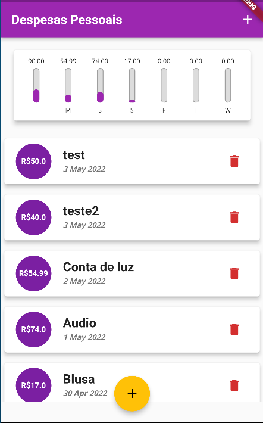
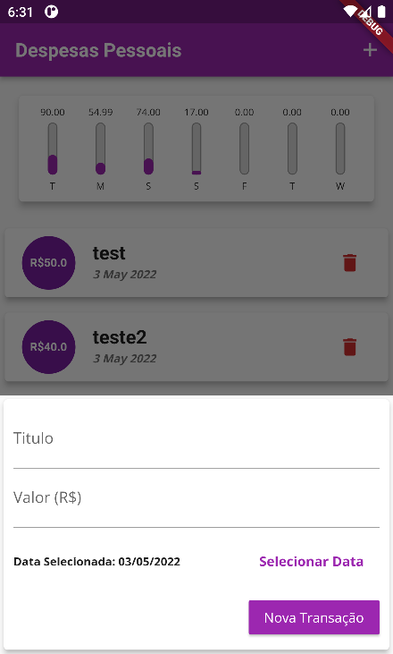
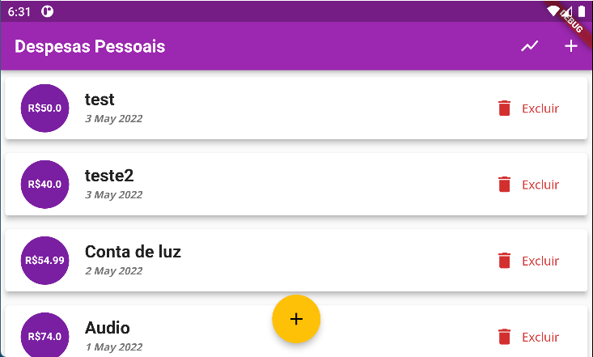
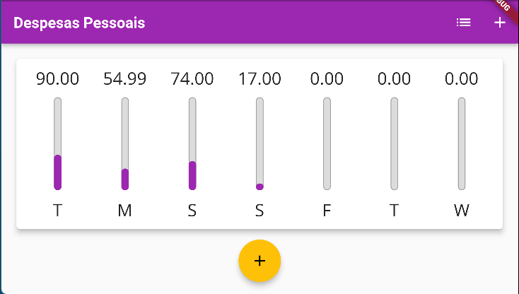

# Aplicativo despesas pessoais

### Status do Projeto

<h4 align="center"> 
	🚧  Flutter Select 🚀 Em construção...  🚧
</h4>

### Features

- [x] Planejamento
- [x] Criando tema
- [x] Criando chart (tela inicial)
- [x] Criando chart_bar (tela inicial)
- [x] Criando lista de transação (tela inicial)
- [x] Criando Formulario de transação (tela inicial)
- [x] Implementando responsividade
- [x] Modo paisagem
- [x] Correções

## 💻 Sobre o projeto

Aplicativo de despesas pessoais onde será calculado todos os gastos semanais do usuario.

## 🎨 Layout

O layout da aplicação:

### Mobile

	
	
	
	

### 🛠 Tecnologias

As seguintes ferramentas foram usadas na construção do projeto:

* [Install Flutter](https://flutter.dev/get-started/)
* [Flutter documentation](https://flutter.dev/docs)
* [Development wiki](https://github.com/flutter/flutter/wiki)
* [Contributing to Flutter](https://github.com/flutter/flutter/blob/master/CONTRIBUTING.md)

### Autor

<a href="https://blog.rocketseat.com.br/author/thiago/">
 
  
 <b>Raul Silva Araujo</b></a> <a href="https://github.com/RaulSAraujo" title="github">🚀</a>

 

### Social

